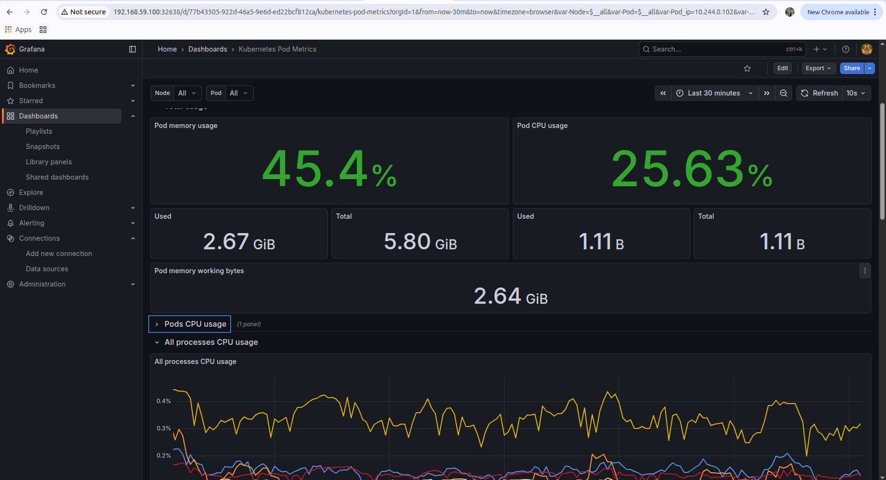

# DevOps End-to-End Project 🚀

## 🏗️ Architecture Overview

This project demonstrates a modern, production-grade DevOps pipeline integrating multiple tools across the SDLC.

- 🚀 **<span style="color:#00BFFF;">Python</span>** — Flask application delivering metrics & health endpoints  
- 🐳 **<span style="color:#1E90FF;">Docker</span>** — Containerization for consistent build & runtime  
- ⚙️ **<span style="color:#FFA500;">Jenkins CI/CD</span>** — Automated build → test → image push → deploy  
- ☸️ **<span style="color:#32CD32;">Kubernetes (Minikube)</span>** — Deployment, scaling & service exposure  
- 🏗️ **<span style="color:#9370DB;">Terraform</span>** — Infrastructure provisioning (S3, IAM, etc.)  
- 📈 **<span style="color:#FF4500;">Prometheus</span>** — Metrics collection & alerting  
- 📊 **<span style="color:#00C853;">Grafana</span>** — Dashboarding and visualization

## Architecture Diagram

```bash
                            +---------------------+
                            |   Developer Laptop  |
                            |  (git push)         |
                            +----------+----------+
                                       |
                                       v
                              Git repository (GitHub)
                        (repo contains app/, k8s/, terraform/, tests)
                                       |
                                       v
+----------------------+          Multibranch               +----------------------+
|   Jenkins (CI/CD)    |<---------------------------------->|  Docker Registry     |
|  - Runs Jenkinsfile  |      (build, test, push image)     |  (Docker Hub)        |
|  - Injects creds     |                                    +----------------------+
|  - Creates k8s secret|
+----------+-----------+
           |
           | Deploy stage: kubectl apply / set image
           v
+--------------------------+            +-----------------------+
|   Kubernetes Cluster     |            |   Terraform (optional)|
|   (Minikube)             |            |   (provisions infra)  |
|                          |  Provisions| - S3 bucket (state)   |
| - devops-python (Pods)   |  or manages| - VPC / subnets       |
|   Deployment, Service    |  resources | - KMS, DynamoDB(locks)|
| - ConfigMap, Secret      |            +-----------------------+
| - HPA (autoscaling)      |
| - Probes & RollingUpdate |
|                          |                      ^
| - Prometheus (installed via Helm)  (scrape)     |
|   ServiceMonitor reads Service ---------------> |
| - Grafana (installed via Helm)  (dashboard)     |
+---+----------------------+-----------------------+
    |                      |
    | NodePort             | NodePort
    | 31000 (Grafana)      | 30000 (Prometheus)
    v                      v
External access: http://<NODE_IP>:31000   http://<NODE_IP>:30000

```


## ⚙️ 2. Setup Instructions

### 📁 2.1 Clone the Repository
Clone the repository and navigate into the project root:

`git clone <your-repo-url>`  
`cd <repo-root>`

---

### 🐍 2.2 Python App (Local Development)
Set up and run the Python application locally:

```bash
python3 -m venv venv
source venv/bin/activate
pip install -r app/requirements.txt
python app/src/app.py
pytest -q
```

## 🐳 2.3 Run with Docker

<span style="color:#42A5F5;">Build and run the Docker image:</span>

`docker build -t devops-interview-python:latest .`  
`docker run -d --name devops-app -p 5000:5000 devops-interview-python:latest`

---

### 🔍 Test Using Endpoints

<span style="color:#66BB6A;">Application Endpoints:</span>

`curl http://localhost:5000/`  
`curl http://localhost:5000/health`  
`curl http://localhost:5000/ready`  
`curl http://localhost:5000/metrics`


## ☸️ 2.4 Kubernetes (Minikube) — Deploy App

<span style="color:#42A5F5;">Start Minikube and deploy the application:</span>

`minikube start`  
`kubectl apply -f k8s/`   ← contains Deployment, Service, ConfigMap, HPA, probes  
`kubectl get pods -n default`  
`kubectl get svc -n default`  
`kubectl rollout status deployment/devops-python -n default`

<span style="color:#66BB6A;">Your app should now be running inside Minikube! 🚀</span>

 ## 🔄 3. CI/CD Pipeline Explanation (Jenkins Multibranch)

### 🎯 Purpose
Automate the pipeline: **build → test → push image → deploy to Kubernetes** using safe DevOps practices such as credential management, image tagging, and automated endpoint checks.

---

## 🚀 High-Level Stages (Jenkinsfile)

### 🧹 1. Clean Workspace
- Runs a fresh cleanup using `cleanWs()`.

### 📥 2. Checkout Source Code
- `checkout scm`  
- Jenkins Multibranch automatically detects the `Jenkinsfile`.

### 🐳 3. Docker Build
- Build the container image:  
  `docker build -t registry/repo:${IMAGE_TAG} .`

### 🔍 4. Endpoint Tests
Run a temporary container and verify endpoints:

- `curl http://localhost:5000/health`  
- `curl http://localhost:5000/metrics`

Ensures the image is healthy **before pushing**.

### 🔐 5. Docker Login & Push
Uses Jenkins credentials to authenticate securely:

- `withCredentials([usernamePassword(...)])`  
- `docker push registry/repo:${IMAGE_TAG}`

### ☸️ 6. Kubernetes Deploy
Uses kubeconfig stored in Jenkins securely:

- `withCredentials([file(credentialsId: 'kubeconfig', variable: 'KUBECONFIG')])`

Apply manifests:

- `kubectl apply -f k8s/`  
- `kubectl set image deployment/devops-python devops-python=registry/repo:${IMAGE_TAG}`  
- `kubectl rollout status deployment/devops-python --timeout=...`

### 🧽 7. Post Cleanup
- Workspace cleanup  
- Optional Slack/Email notifications  
- Improves agent hygiene & pipeline reliability

<span style="color:#00C853;">✔ CI/CD ensures fully automated, repeatable, and safe deployments.</span>


# ☸️ 4. Kubernetes Deployment Flow (What Manifests Do & Why)

## 📂 Files Included in `k8s/`

### 📦 deployment.yaml — <span style="color:#42A5F5;">Deployment Spec</span>
- RollingUpdate strategy (maxSurge, maxUnavailable) → **zero downtime**  
- Liveness probe → `/health` (restart container if unhealthy)  
- Readiness probe → `/ready` (prevents traffic until app is ready)

### 🌐 service.yaml — <span style="color:#66BB6A;">Service (ClusterIP / NodePort)</span>
- Named port **"http"** mapping: `port 80 → targetPort 5000`  
- Prometheus annotations optional (ServiceMonitor recommended)

### ⚙️ configmap.yaml  
- Stores **non-sensitive** app configuration

### 🔐 secret  
- Created by Jenkins at deploy time  
- Not stored in repo for security reasons

### 📈 hpa.yaml — <span style="color:#FFA726;">Autoscaling</span>
- CPU-based HorizontalPodAutoscaler example

### 📡 servicemonitor.yaml  
- Tells **Prometheus** how to scrape the Service

---

## 🔄 Deployment Lifecycle

- `kubectl apply -f k8s/` → creates/ensures all Kubernetes resources  
- Jenkins updates image using:  
  `kubectl set image deployment/devops-python devops-python=registry/repo:${IMAGE_TAG}`  
- Kubernetes performs a **rolling update**  
- Verify rollout:  
  `kubectl rollout status deployment/devops-python`  
- Rollback if required:  
  `kubectl rollout undo deployment/devops-python`  
- Ensure ServiceMonitor labels **match** Service labels/port names for proper scraping

## 🔎 Verification

Use the following commands to verify the deployment status in Kubernetes:

`kubectl get deploy,svc,hpa,cm,secrets -n default`  
`kubectl describe pod <pod> -n default`  
`kubectl logs <pod> -n default`  
`kubectl get servicemonitor -n default`

<span style="color:#00C853;">✔ All components should be visible and healthy after deployment.</span>

<span style="color:#00C853;">✔ This setup ensures reliable, observable, and production-grade Kubernetes deployments.</span>


## 5. Terraform structure explanation (what to include and how to run) Repo layout (terraform/)

## 🗂️ Terraform Project Structure

terraform/  
├── backend.tf                ← optional remote backend (S3 + DynamoDB)  
├── providers.tf  
├── versions.tf  
├── main.tf                   ← root file calling modules  
├── variables.tf  
├── outputs.tf  
├── terraform.tfvars.example  
└── modules/  
    ├── s3/                   ← S3 bucket module (versioning, KMS, lifecycle)  
    └── vpc/                  ← VPC module (subnets, IGW, route tables)

---

## 🪣 S3 Module Features
- 🌐 <span style="color:#42A5F5;">Versioning (Enabled)</span>  
- 🔐 <span style="color:#FF7043;">Server-side encryption (KMS)</span>  
- 🚫 Public access block  
- ♻️ Lifecycle rules (log expiry, non-current version cleanup)  
- 📄 Optional logging target  
- 🛡️ IAM policy template  

---

## ⭐ Best Practices
- 📦 Use **modules** for reusability  
- ⚙️ Use **variables & outputs** to make code dynamic  
- 🧹 Run `terraform fmt` & `terraform validate` in CI  
- 🏗️ Use **remote backend** (S3 + DynamoDB) for shared state  
- 🪣 Create backend bucket manually before first apply  
- 📝 Pass backend config during `terraform init` (or store in backend.tf carefully)

---

## 🧪 Basic Terraform Commands
`terraform init`  
`terraform plan -out plan.tfplan`  
`terraform apply plan.tfplan`  
`terraform destroy`


## 📊 Dashboard (Panels & PromQL)

### ✅ Application Availability (Stat Panel)
PromQL: `up{job=~"devops-python.*|devops-python-sm.*"}`

### ⚡ Requests per Second (RPS) — Time Series
PromQL: `rate(requests_total[1m])`

### 📈 Total Requests (Last 5m)
PromQL: `increase(requests_total[5m])`

### 🧠 Pod CPU Usage — Time Series (per pod)
PromQL: `rate(container_cpu_usage_seconds_total{pod=~"devops-python-.*"}[1m])`

### 💾 Pod Memory Usage — Time Series
PromQL: `container_memory_usage_bytes{pod=~"devops-python-.*"}`

### 🔁 Pod Restarts — Stat Panel
PromQL: `rate(kube_pod_container_status_restarts_total{pod=~"devops-python-.*"}[5m])`

### 📦 Pod Count — Stat Panel
PromQL: `count(kube_pod_info{pod=~"devops-python-.*"})`

---

## 📤 Dashboard Delivery
- Dashboard JSON stored under `monitoring/grafana/`
- Provisioned via ConfigMap with label `grafana_dashboard: "1"`
- Automatically loaded by Grafana sidecar


## 7. Problems Faced & How They Were Solved (Real Examples)

### 🧩 CRD Installation Failure (Helm)
**Symptom:** Helm failed to install CRDs for kube-prometheus-stack.  
**Fix:** Run `helm pull prometheus-community/kube-prometheus-stack --untar`, then apply CRDs manually using `kubectl apply -f kube-prometheus-stack/crds/` (requires cluster-admin). After that, run Helm install/upgrade with `--skip-crds` or perform normal install.

### 📡 Prometheus Not Scraping App (ServiceMonitor Mismatch)
**Symptom:** Target not visible in Prometheus.  
**Fix:** Ensure Service has a named port (e.g., `name: http`). ServiceMonitor `endpoints.port` must match exactly, `selector.matchLabels` must match Service labels, and `namespaceSelector` must include the app's namespace.

### 🔐 Image Push Error (Docker Hub Token Scope Issue)
**Symptom:** `authentication required: insufficient scopes`  
**Fix:** Create a Docker Access Token with `write:packages` and `write:repository` scopes, then update the Jenkins credential.

### 🔑 kubectl Auth Errors in Jenkins
**Symptom:** Jenkins cannot run kubectl (permission denied / no kubeconfig).  
**Fix:** Store kubeconfig as a Jenkins file credential, then load it using `withCredentials` into `~/.kube/config` on the agent, OR configure a Kubernetes service account with proper RBAC.

### 📉 Grafana Dashboards Not Loading
**Symptom:** Dashboard ConfigMap exists but Grafana does not display it.  
**Fix:** Ensure ConfigMap has label `grafana_dashboard: "1"` and Grafana sidecar is enabled in Helm values (so it picks up labeled ConfigMaps).

### 🚫 ImagePullBackOff After Deployment
**Symptom:** Pod shows `ImagePullBackOff`.  
**Fix:** Validate image name/tag and registry authentication, ensure access to private/public registry is configured, and verify CI inserted the correct image tag into the deployment manifest.


### 📊 Grafana Dashboard Output


> This dashboard displays application-level metrics from Prometheus


